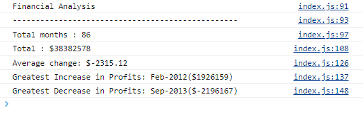

# Challenge-4
JavaScript - Console Finances 

##Description:

The aim of this project was to carry out data analysis using JavaScript and produce a summary report of the data.

##Lessons learnt from this project:

- Undersatnding the syntax and structuring the code logically to obtain results
- How to iterate a 2D array using nested for loop
- The different array functions in JS and how to use them. e.g reduce() - used to reduce the values of an array into one value, which can be used to find max and min values and sum of the array values. e.g. indexOf() - used to find the position of an element in an array or the frequency of it.

##Usage:

To view the data report summary open chrome DevTools by pressing Command+Option+I (macOS) or Control+Shift+I (Windows). Alternatively, you can right-click and select the "inspect" option. The console panel should open at the bottom of the screen or select the "console" tab from the main toolbar to open the console panel at the top of the screen.

##Installation:

N/A

##Credits:

N/A

##License:

Please refer to the LICENSE in repository
